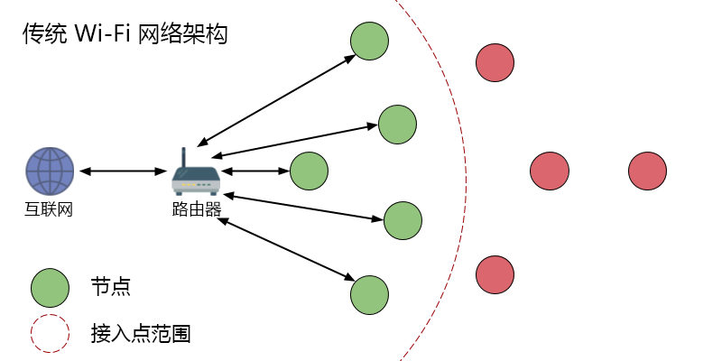
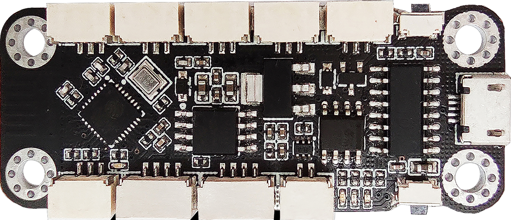

# ESP-WIFI-MESH DEMO / FrogMaker

使用Europa & ESP-WIFI-MESH构建Wi-Fi Mesh网络的演示程序

## ESP-WIFI-MESH

## Europa

 [青蛙创客官方店](https://item.taobao.com/item.htm?id=618006256099)

## Arduino 依赖库

1. ArduinoJson
2. Servo
3. Adafruit_NeoPixel
4. painlessMesh